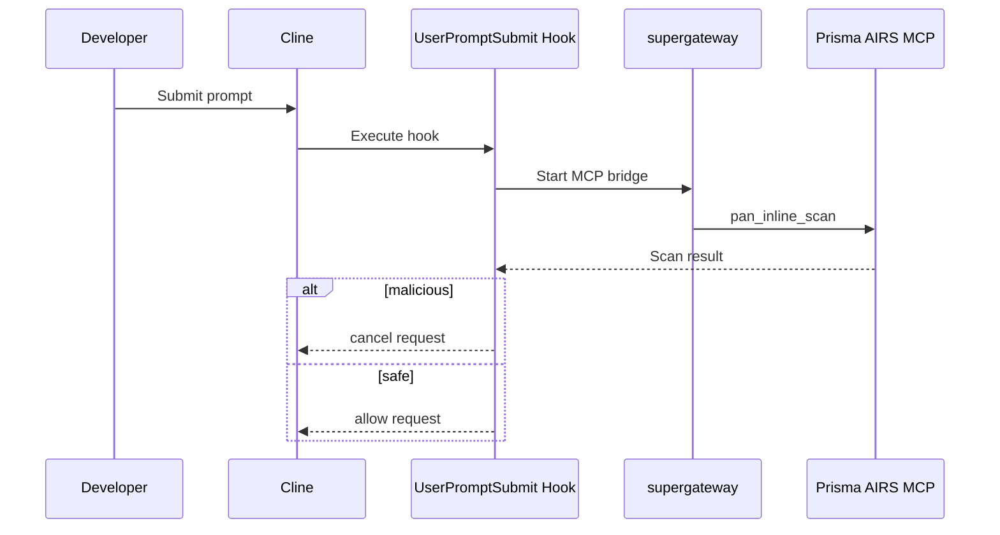

# Prisma AIRS Prompt Security for Cline (VS Code)

Automatically scans and blocks malicious prompts in Cline using Palo Alto Networks Prisma AIRS via MCP.

**Author:** Chris Martin  
**Assisted by:** Claude (Anthropic) + ChatGPT

---

## Overview

This integration protects developers using Cline by scanning every prompt before it reaches the AI model.

Features:

- ✅ Automatic prompt scanning
- ✅ No manual tool usage required
- ✅ Blocks malicious prompts before LLM execution
- ✅ Transparent developer workflow
- ✅ Uses Prisma AIRS security policies

---

## Architecture

Prerequisites

VS Code

Cline extension

Node.js installed

Prisma AIRS API key & profile

Setup
Configure MCP server in Cline

Edit Cline MCP settings:

{
  "mcpServers": {
    "prisma-airs": {
      "command": "npx",
      "args": [
        "-y",
        "supergateway",
        "--sse",
        "https://service.api.aisecurity.paloaltonetworks.com/mcp/sse",
        "--header",
        "x-pan-token: YOUR_API_KEY",
        "--header",
        "x-pan-profile: Cline",
        "--logLevel",
        "none"
      ],
      "alwaysAllow": ["pan_inline_scan"],
      "autoApprove": ["pan_inline_scan"],
      "disabled": false
    }
  }
}

{
  "mcpServers": {
    "prisma-airs": {
      "command": "npx",
      "args": [
        "-y",
        "supergateway",
        "--sse",
        "https://service.api.aisecurity.paloaltonetworks.com/mcp/sse",
        "--header",
        "x-pan-token: YOUR_API_KEY",
        "--header",
        "x-pan-profile: Cline",
        "--logLevel",
        "none"
      ],
      "alwaysAllow": ["pan_inline_scan"],
      "autoApprove": ["pan_inline_scan"],
      "disabled": false
    }
  }
}

