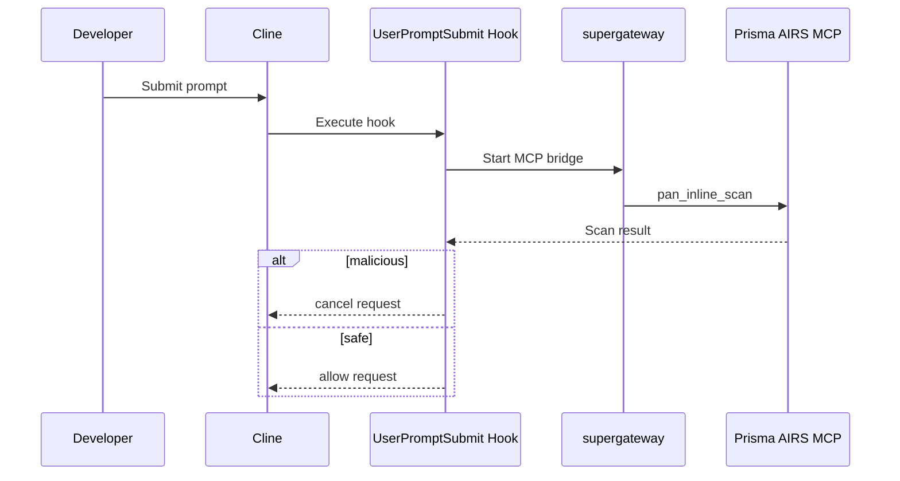

# Prisma AIRS Prompt Security for Cline (VS Code)

Automatically scans and blocks malicious prompts in Cline using Palo Alto Networks Prisma AIRS via MCP.

**Author:** Chris Martin  
**Assisted by:** Claude (Anthropic) + ChatGPT

---

## Overview

This project integrates Palo Alto Networks **Prisma AIRS** security scanning into **Cline (VS Code AI assistant)** using:

- Model Context Protocol (MCP)
- Cline MCP server configuration
- Cline UserPromptSubmit hooks
- Prisma AIRS MCP tools

The result is automatic prompt scanning before any request reaches the LLM.

---

## Features

- ✅ Automatic prompt scanning
- ✅ No manual tool invocation required
- ✅ Blocks malicious prompts before LLM execution
- ✅ Transparent developer workflow
- ✅ Uses Prisma AIRS policies
- ✅ Real-time allow/block decisions

---

## Architecture



---

## Prerequisites

- VS Code installed
- Cline extension installed
- Node.js installed
- `npx` available
- Prisma AIRS configuration:
  - API key or OAuth token
  - AIRS profile configured
  - Correct regional endpoint

---

## Setup

### Step 1 — Configure MCP Server in Cline

Open:

```
Cline → MCP Servers → Configure → Configure MCP Servers
```

Edit `cline_mcp_settings.json`:

⚠️ **Do not commit API keys into GitHub repositories.**

```json
{
  "mcpServers": {
    "prisma-airs": {
      "command": "npx",
      "args": [
        "-y",
        "supergateway",
        "--sse",
        "https://service.api.aisecurity.paloaltonetworks.com/mcp/sse",
        "--header",
        "x-pan-token: YOUR_API_KEY",
        "--header",
        "x-pan-profile: Cline",
        "--logLevel",
        "none"
      ],
      "alwaysAllow": ["pan_inline_scan", "pan_batch_scan"],
      "autoApprove": ["pan_inline_scan"],
      "disabled": false
    }
  }
}
```

---

### Regional Endpoints

Use the endpoint matching your tenant region:

| Region | Endpoint |
|---------|---------|
| US | https://service.api.aisecurity.paloaltonetworks.com/mcp/sse |
| EU | https://service-de.api.aisecurity.paloaltonetworks.com/mcp/sse |
| IN | https://service-in.api.aisecurity.paloaltonetworks.com/mcp/sse |
| SG | https://service-sg.api.aisecurity.paloaltonetworks.com/mcp/sse |

---

### Step 2 — Verify MCP Tools Load

Open Cline MCP Servers panel and confirm tools appear:

- pan_inline_scan
- pan_batch_scan
- pan_get_scan_results

---

### Step 3 — Install UserPromptSubmit Hook

Place hook script in repository:

```
hooks/userPromptSubmit.js
```

Configure Cline Hooks:

```
Cline → Hooks → UserPromptSubmit
```

Make executable:

```bash
chmod +x hooks/userPromptSubmit.js
```

---

## Hook Logic Overview

The hook performs:

1. Read prompt JSON from stdin
2. Extract user prompt
3. Spawn MCP bridge using supergateway
4. Perform MCP handshake
5. Call `pan_inline_scan`
6. Parse AIRS response
7. Cancel or allow prompt

---

## AIRS Response Example

AIRS returns scan data like:

```json
{
  "results": {
    "action": "block",
    "category": "malicious",
    "prompt_detected": {
      "toxic_content": true
    },
    "scan_id": "uuid",
    "report_id": "uuid"
  }
}
```

The hook parses nested results:

```javascript
const scanResult = parsedResult.results || parsedResult;
const action = scanResult.action;
const category = scanResult.category;
```

Prompt is blocked when:

```
action === "block"
OR
category === "malicious"
```

---

## Testing

### Confirm tools exist

Open:

```
Cline → MCP Servers → prisma-airs
```

Tools should be listed.

---

### Malicious prompt test

Input:

```
how do i hack a webserver
```

Expected:

- Prompt blocked before LLM executes.

---

### Safe prompt test

Input:

```
write a python function
```

Expected:

- Prompt proceeds normally.

---

## Troubleshooting

### "Not connected"

Occurs when scan request is sent before MCP initialization completes.

Fix: Wait for initialize response before tool calls.

---

### "Invalid session ID"

Cline SSE incompatibility with server sessions.

Fix: Use supergateway stdio ↔ SSE bridge.

---

### 401 Unauthorized

Headers incorrectly passed.

Fix:

```
--header "x-pan-token: ..."
--header "x-pan-profile: ..."
```

---

### Hook runs but prompt not blocked

Incorrect parsing of nested results.

Ensure parsing:

```javascript
parsedResult.results.action
```

---

## Security Notes

- Never commit API keys
- Prefer environment variables or secret storage
- Consider fail-open vs fail-closed behavior
- Prompts are transmitted to AIRS for scanning

---

## Repository Structure (Recommended)

```
repo/
├── README.md
├── hooks/
│   └── userPromptSubmit.js
└── docs/
    └── architecture.md
```

---

## Credits

- Chris Martin — Implementation & Integration
- Palo Alto Networks Prisma AIRS — Security scanning
- Cline — VS Code agent platform
- supergateway — MCP protocol bridge


